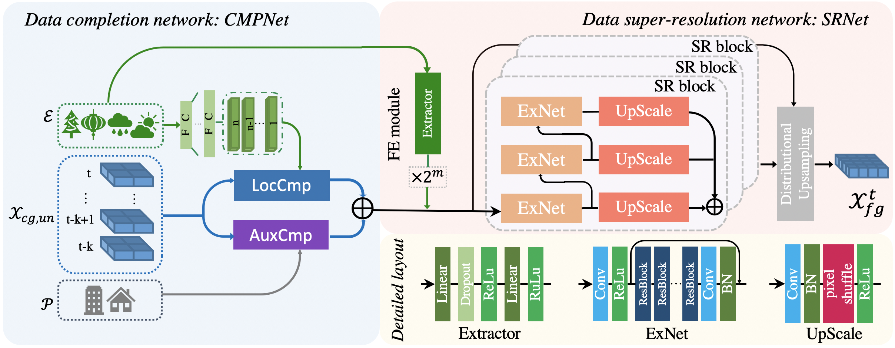

# mtcsr

#### paper descrition
In this paper, we make the first attempt to infer fine-grained urban flows based on the incomplete coarse-grained urban flow observations, and propose a Multi-Task urban flow Completion and Super-Resolution network (MT-CSR for short) to simultaneously complete the coarse-grained urban flows and infer the fine-grained flows. Specifically, MT-CSR consists of the data completion network (CMPNet for short) and data super-resolution network (SRNet for short). CmpNet is composed of a local spatial information based data completion module LocCmp and an auxiliary information based data completion module AuxCmp to consider both the local geographical and global semantic correlations for urban flow data completion. SRNet is designed to capture the complex associations between fine- and coarse-grained urban flows and upsample the coarse-grained data by stacking the designed super-resolution blocks. To gain an accurate inference, two parts are jointly conducted under a multi-task learning framework, and trained in an end-to-end manner using a two-stage training strategy. 


paper：[Fine-grained Urban Flow Inference with Incomplete Data](https://ieeexplore.ieee.org/abstract/document/9723595)

#### code description

run code with:

```
python main.py
```

